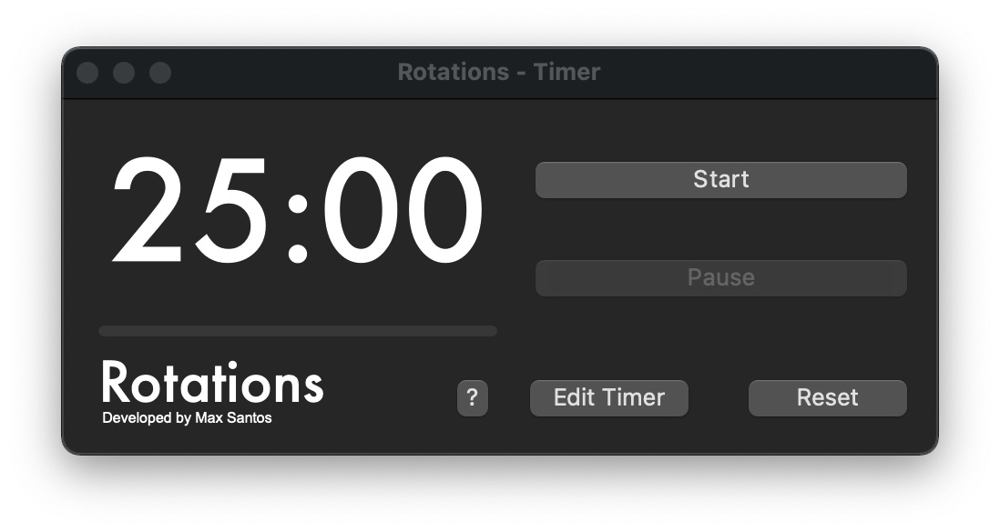

# Rotations
Since I can't find anything useful to provide a easy work timer on Linux, I made a simple pomodoro timer on both Linux and macOS:

FOR MACOS:

    Drag the app into your applications folder.

FOR LINUX:

    You can use the executable however you'd like. You can also create a app alias like stated here:
    https://linuxconfig.org/how-to-create-desktop-shortcut-launcher-on-ubuntu-20-04-focal-fossa-linux/
